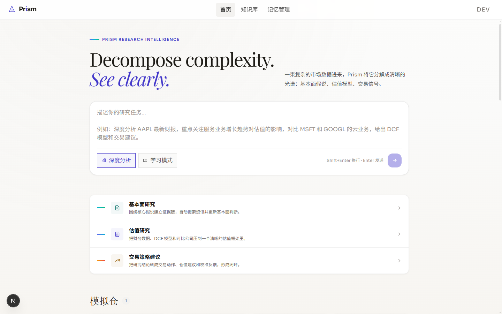
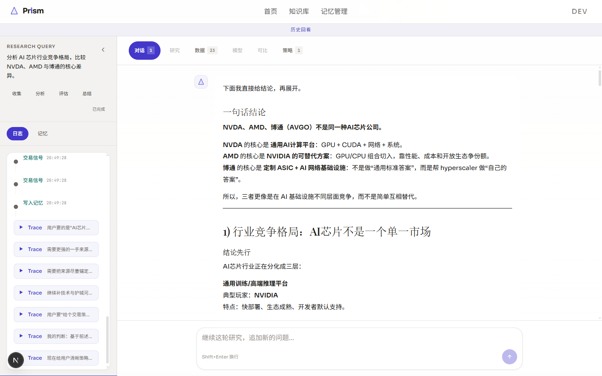
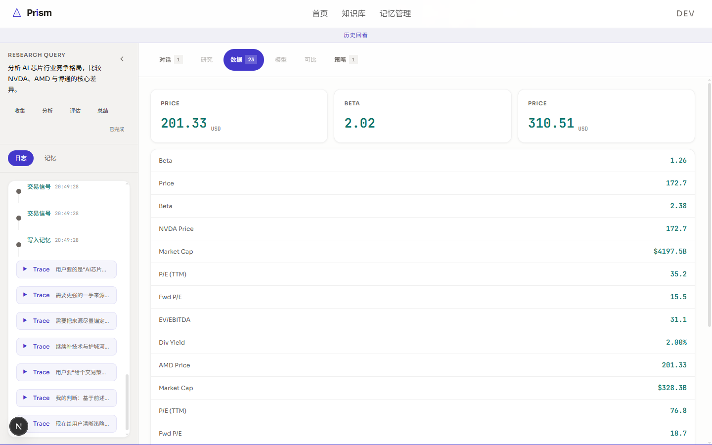
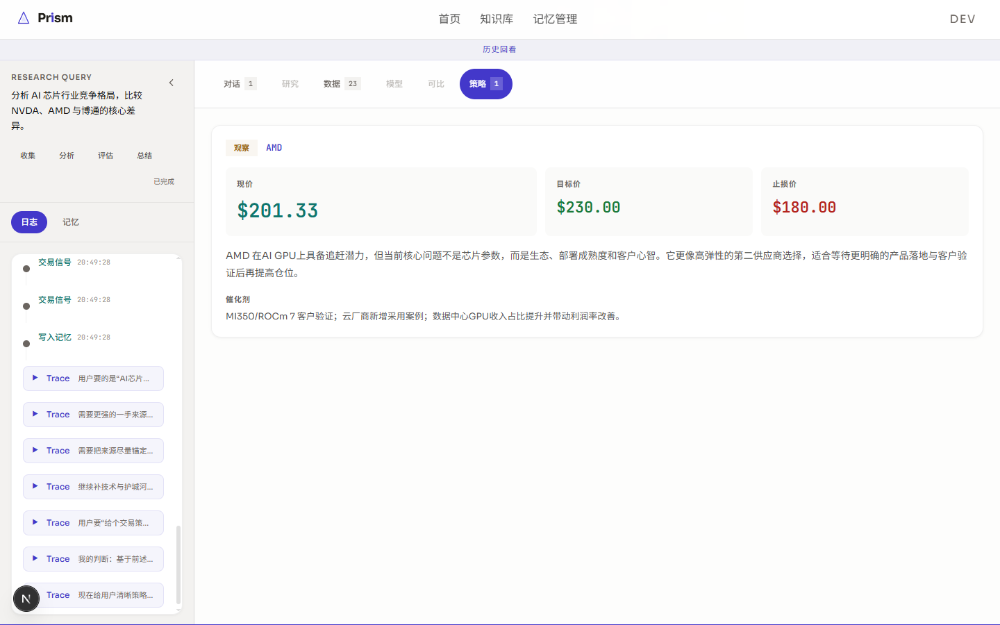
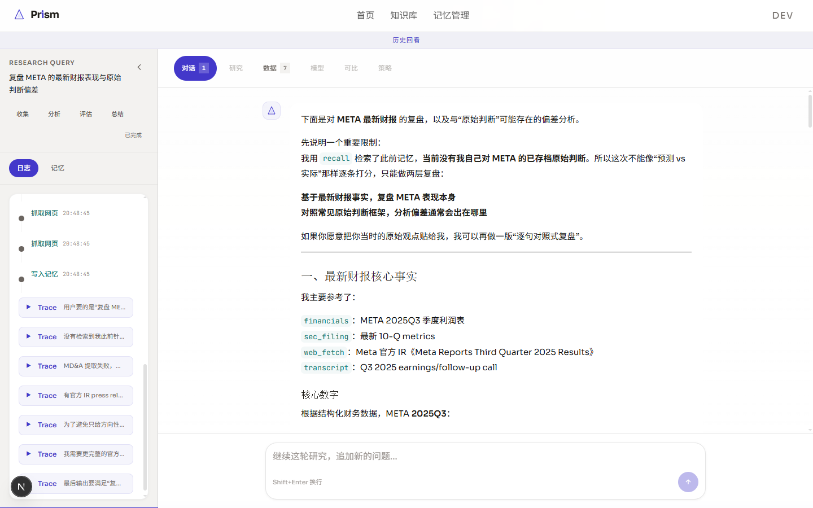
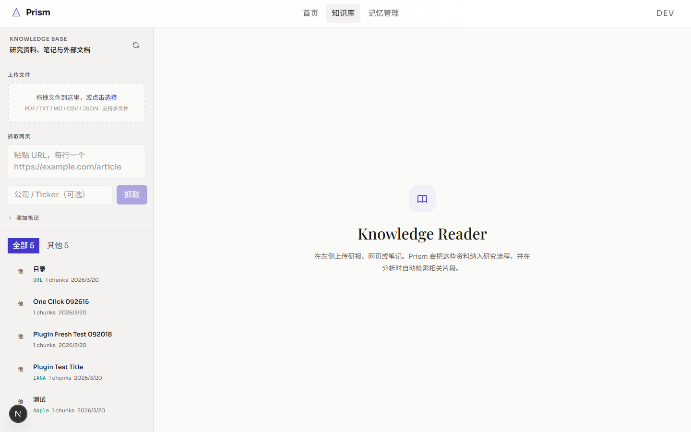
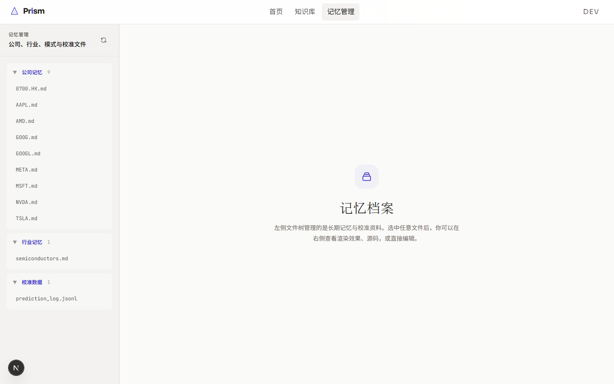
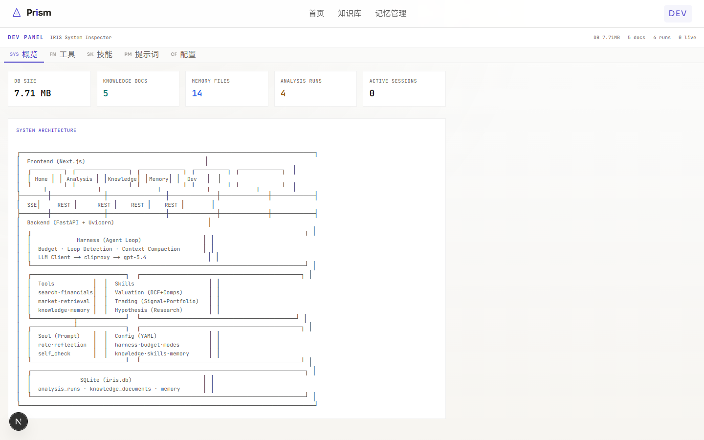

# Prism — AI 自主投研智能体

<p align="center">
  
</p>

> **Decompose complexity. See clearly.**
>
> 一束复杂的市场数据进来，Prism 将它分解成清晰的光谱：基本面假说、估值模型、交易信号。

---

## Prism 是什么？

Prism 是一个 **自主投研 Agent**，把自然语言描述的研究任务转化为结构化、有证据支撑的投资分析报告。它结合 LLM 控制循环（Harness）、领域技能（Skills）和丰富的工具套件，复刻专业股票分析师的完整工作流 —— 从基本面深度研究、DCF 估值、到交易信号生成。

### 核心能力

| 能力 | 说明 |
|---|---|
| **基本面研究** | 假设驱动的贝叶斯证据链分析。自动搜索新闻、SEC 财报、业绩电话会、以及你自己的知识库。 |
| **估值模型** | DCF 现金流折现、可比公司分析、公允价值估算，支持牛/熊/基准多场景敏感性。 |
| **交易策略** | 将研究结论转化为可执行的交易信号，含仓位建议、模拟交易执行和组合追踪。 |
| **知识库** | 上传 PDF、研报、网页 URL —— Prism 自动分块、向量化，分析时智能检索相关片段。 |
| **记忆系统** | 按公司、按行业持久化笔记，跨会话积累，实现长期研究连续性。 |
| **学习与校准** | 复盘过去的预测与实际结果，识别判断偏差，持续自我改进。 |

---

## 界面截图

### 首页 — 研究入口与技能总览

输入自然语言研究任务，选择「深度分析」或「学习模式」，一键启动自主研究流程。

<p align="center"></p>

### 深度分析 — AI 芯片行业竞争格局

左侧显示实时工具调用日志（检索记忆 → 拉取财报 → SEC Filing → 搜索资讯 → 交易信号），右侧流式输出结构化研究报告。Agent 自主完成 23 次数据调用，生成完整行业对比分析。

<p align="center"></p>

### 数据面板 — 自动收集的财务数据

分析过程中自动拉取的所有财务指标（价格、PE、EV/EBITDA、市值等）集中展示，支持多标的对比。

<p align="center"></p>

### 策略面板 — 交易信号与仓位建议

研究结论自动转化为交易策略卡片：现价、目标价、止损价、催化剂、核心逻辑。

<p align="center"></p>

### 学习模式 — META 财报复盘与偏差分析

学习模式下，Prism 主动复盘过去的判断，对照最新财报事实，识别认知偏差。这是系统自我校准的核心机制。

<p align="center"></p>

### 知识库 — 上传与管理研究资料

支持拖拽上传 PDF/TXT/MD/CSV/JSON，抓取网页 URL，手动添加笔记。所有资料自动分块向量化，分析时智能检索。

<p align="center"></p>

### 记忆管理 — 公司与行业长期记忆

按公司（AAPL、NVDA、META...）和行业（semiconductors）分类的持久化笔记，以及校准数据（prediction_log）。跨会话积累，越用越懂你的研究偏好。

<p align="center"></p>

### 开发面板 — 系统架构总览

完整展示系统分层架构：Frontend → Backend → Harness → Skills/Tools → Soul → SQLite。

<p align="center"></p>

---

## 两种工作模式

Prism 支持两种模式，分别对应投研的两个阶段：

### 深度分析模式（Analysis）

用于实时研究。输入一个研究问题，Agent 自主完成：
1. **收集** — 调用搜索、财报、SEC Filing、业绩电话会等工具收集一手数据
2. **分析** — 建立假设，用贝叶斯框架评估证据强度
3. **评估** — 构建估值模型（DCF + 可比），计算公允价值区间
4. **总结** — 输出结构化报告 + 交易信号 + 仓位建议

### 学习模式（Learning）

用于复盘与自我校准。Agent 会：
- 回顾此前对某公司/行业的判断
- 对照最新财报数据和市场表现
- 识别预测偏差（哪些判断对了，哪些错了，为什么）
- 将经验教训写入记忆，供未来分析参考

学习模式让 Prism **不只是工具，而是一个持续进化的研究伙伴**。每次复盘都在修正系统的认知模型。

---

## 系统架构

```
Frontend (Next.js + React + Tailwind)
├── 首页 / 分析 / 知识库 / 记忆管理 / 开发面板
│
│── SSE（流式推理） + REST API
│
Backend (FastAPI + Uvicorn)
├── Harness（Agent 控制循环）
│   ├── 预算控制 · 循环检测 · 上下文压缩
│   └── LLM Client → cliproxy → gpt-5.4
├── Skills（领域技能）
│   ├── fundamentals — 深度研究方法论
│   ├── valuation — DCF + 可比公司框架
│   ├── trading — 信号生成 + 模拟执行
│   └── hypothesis — 贝叶斯证据评估
├── Tools（15+ 工具）
│   ├── 市场: quote, history, financials, macro
│   ├── 研究: exa_search, web_fetch, sec_filing, transcript
│   ├── 知识: search_knowledge, url_ingest, chunker, embedder
│   └── 记忆: remember, recall, unified_memory
├── Soul（提示层）
│   ├── role, reflection, self_check, steering
│   └── 贝叶斯证据评估框架
└── SQLite (iris.db)
    └── analysis_runs, knowledge_documents, memory, embeddings
```

---

## 快速开始

### 前置条件

- **Python 3.11+**
- **Node.js 18+**
- API Key：OpenAI 兼容的 LLM 端点、[EXA](https://exa.ai) 搜索、[FMP](https://financialmodelingprep.com) 金融数据

### 1. 克隆 & 安装

```bash
git clone https://github.com/AlexZWANG1/touzibishi.git
cd touzibishi

# 后端
pip install -r requirements.txt

# 前端
cd iris-frontend
npm install
```

### 2. 配置

创建 `iris-frontend/.env.local`：
```env
NEXT_PUBLIC_API_URL=http://localhost:8000
```

编辑 `iris/iris_config.yaml` 调整 Harness 参数（工具轮次、预算、超时时间）。

设置 API Key 为环境变量或配置到代理中。

### 3. 启动

```bash
# 终端 1 — 后端
cd iris
python -m uvicorn backend.api:app --host 0.0.0.0 --port 8000

# 终端 2 — 前端
cd iris-frontend
npm run dev
```

打开 **http://localhost:3000** 开始研究。

---

## 核心技能（Skills）

Skills 是 Prism 的领域能力单元。每个 Skill 包含一个 `SKILL.md`（行为提示词）和 `tools.py`（专用工具函数），由 Harness 在运行时自动加载。

### 基本面研究 (`iris/skills/fundamentals/`)
深度研究方法论：围绕核心假说建立证据链，自动搜索多来源信息（SEC Filing、业绩电话会、新闻、知识库），用贝叶斯推理评估证据强度，产出结构化论文级研究报告。

### 估值分析 (`iris/skills/valuation/`)
构建 DCF 现金流折现模型和可比公司分析。自动拉取财务数据，计算公允价值区间，支持牛市/基准/熊市三场景敏感性分析。

### 交易策略 (`iris/skills/trading/`)
将研究结论转化为交易信号。支持信号生成（含置信度）、仓位计算、模拟交易执行、以及组合追踪与回顾。

### 假设管理 (`iris/skills/hypothesis/`)
贝叶斯证据链管理。创建投资假设，附加支持/反驳证据卡片（带权重），追踪置信度随时间的演化。

---

## 工具套件（15+ 工具）

| 类别 | 工具 | 说明 |
|---|---|---|
| **市场数据** | `quote`, `history`, `financials`, `macro` | 实时报价、历史行情、财务报表、宏观指标 |
| **信息搜索** | `exa_search`, `web_fetch` | 全网搜索 + 网页内容提取 |
| **SEC 文件** | `sec_filing`, `transcript` | 10-K/10-Q 年报季报、业绩电话会纪要 |
| **估值** | `valuation` | DCF、可比公司、公允价值计算 |
| **知识库** | `search_knowledge`, `url_ingest` | 向量检索上传的文档 |
| **记忆** | `remember`, `recall` | 跨会话持久化记忆 |
| **交易** | `generate_trade_signal`, `execute_trade`, `get_portfolio` | 信号生成、交易执行、组合查看 |

---

## 可拓展性

Prism 采用 **三层解耦架构**（Harness / Context / Prompt），每一层都可以独立修改和扩展，无需改动其他层的代码。

### 添加新工具

```
iris/tools/my_tool.py
```

1. 在 `iris/tools/` 下新建 Python 文件
2. 定义函数，加上类型注解和 docstring —— Harness 自动发现并注册
3. 在 `iris_config.yaml` 的 `always_exposed_tools` 中添加工具名
4. （可选）在 `tool_triggers` 中配置关键词触发

```python
# 示例：添加一个新闻情绪分析工具
def sentiment_analysis(text: str, ticker: str = "") -> dict:
    """分析文本的市场情绪倾向，返回 bullish/bearish/neutral 及置信度。"""
    # 你的实现...
    return {"sentiment": "bullish", "confidence": 0.85}
```

### 添加新技能

```
iris/skills/my_skill/
├── SKILL.md    # 技能提示词 — 定义 Agent 在该领域的行为方式
└── tools.py    # 技能专用工具函数
```

1. 在 `iris/skills/` 下创建目录
2. `SKILL.md` 定义该技能的研究方法论、输出格式、判断标准
3. `tools.py` 定义技能专用的工具函数
4. 在 `iris_config.yaml` 的对应模式 `skills` 列表中注册

技能的本质是 **结构化的 prompt + 专用工具**，不需要修改 Harness 代码。你可以轻松添加如「宏观经济分析」「期权策略」「ESG 评估」等新技能。

### 自定义 Soul（人格层）

```
iris/soul/
├── role.md         # 角色定义
├── v0.1.md         # 投资哲学与风险框架
├── reflection.md   # 反思与学习方法论
├── self_check.md   # 自检清单
└── steering.md     # 行为导向
```

Soul 层是纯提示词，定义 Agent 的推理风格、风险哲学和自检标准。修改这些文件不需要改任何代码，但会深刻影响 Agent 的判断方式。

### 配置调优

所有行为参数集中在 `iris/iris_config.yaml`：

| 参数域 | 可调内容 |
|---|---|
| **harness** | 最大工具轮次、总调用上限、超时时间、上下文压缩阈值 |
| **modes** | analysis / learning 模式各自的技能组合和工具集 |
| **vector_search** | 嵌入模型、top-k 检索数量 |
| **knowledge** | 文档分块大小和重叠长度 |
| **loop_detection** | 循环检测阈值和处理策略 |
| **compaction** | 上下文压缩策略、记忆冲刷提示词 |

---

## 成本

Prism **开源免费自托管**。使用成本来自底层 API：

| 服务 | 用途 | 典型成本 |
|---|---|---|
| LLM API（OpenAI 兼容） | 核心推理引擎 | ~$0.05–0.50 / 次分析 |
| EXA Search API | 全网搜索 | 有免费额度 |
| FMP API | 金融数据 & 财务报表 | 有免费额度 |

一次典型的深度分析（25 轮工具调用）大约消耗 **$0.10–0.30** 的 LLM API 费用。

---

## 技术栈

- **前端**: Next.js 14, React, TypeScript, Tailwind CSS
- **后端**: Python, FastAPI, Uvicorn
- **数据库**: SQLite
- **向量嵌入**: OpenAI `text-embedding-3-small`
- **LLM**: 任何 OpenAI 兼容 API（GPT-4o, GPT-5.4 等）

---

## License

MIT

---

<p align="center">
  <sub>为独立投研而生。</sub>
</p>
